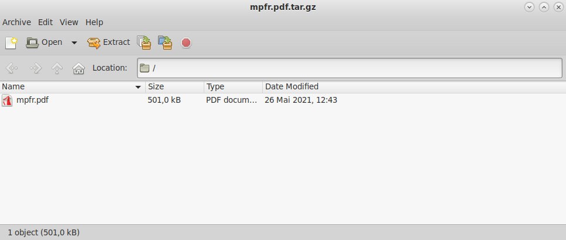

<span class="badge-placeholder">[](https://travis-ci.org/github/mate-desktop/mate-desktop)</span>
<span class="badge-placeholder">[](https://github.com/mate-desktop/mate-desktop/releases/latest)</span>
<span class="badge-placeholder">[](https://github.com/mate-desktop/engrampa/graphs/contributors)</span>
<span class="badge-placeholder">[](https://github.com/mate-desktop/engrampa/blob/main/LICENSE)</span>

[Source Code](https://github.com/mate-desktop/engrampa) | [Bug Tracker](https://github.com/mate-desktop/engrampa/issues) | [Dependencies](https://github.com/mate-desktop/engrampa/blob/master/.build.yml)




Engrampaは、MATE Desktop Environment の公式なアーカイブマネージャです。tar や zip などのファイル圧縮ユーティリティのグラフィカルなフロントエンドです。これは File Roller のフォークです。

Engrampa では、書庫（アーカイブ）からのファイル作成、変更および展開など最も一般的な操作をサポートします。また、書庫の内容を一覧表示したり、書庫に含まれているファイルを開いたりすることもできます。

    <--->

[](../images/engrampa-window.png)






シンタックス（構文）

       engrampa [オプション...] [ファイル...]

オプション

       filename(s)...
           Engrampa の起動時に開く書庫（ファイル）を指定します。ファイルを指定しない場合、
           Engrampa は空白のウィンドウで起動するので、メニューから、または CTRL + O の
              ショートカットでファイルを開くことができます。

       -a, --add-to=ARCHIVE
              指定した書庫にファイルを追加し、プログラムを終了します

       -d, --add FILE
              書庫に名前を付けてファイルを追加し、プログラムを終了します

       -e, --extract-to=FOLDER
              指定したフォルダに書庫を展開し、プログラムを終了します

       -f, --extract
              保存先のフォルダを確認して書庫を展開した後、プログラムを終了します

       -h, --extract-here
              書庫名を展開先のフォルダとして使用して展開し、プログラムを終了します。

       --default-dir=FOLDER
           '--add' および '--extract' コマンドに使用する既定のフォルダ

       --force
              確認メッセージを表示せずに宛先フォルダを作成します。

       --display=DISPLAY
              使用する X ディスプレイ。

       -?, --help
              標準的なコマンドラインオプションを表示します。

       --help-all
              すべてのコマンドラインオプションを表示します。

       --version
              このアプリケーションのバージョンを表示します。

       このプログラムでは、GTK の標準的なオプションも使用できます。



## ビルド / インストール

シンプルなビルド方法:

```
$ git submodule update --init --recursive   # Git サブモジュールの初期化
$ ./autogen.sh --prefix=/usr                # ビルドの設定
$ make                                      # ビルド
```
別のプリフィックスにインストールする場合は、上記の `./autogen.sh` コマンドを次のように変更します。

```
$ ./autogen.sh --prefix=/an/other/path
```

パッケージのビルドが完了したら、次のようにしてインストールすることができます。

```
[ 必要に応じて root になってください ]
$ make install                              # インストール
```

